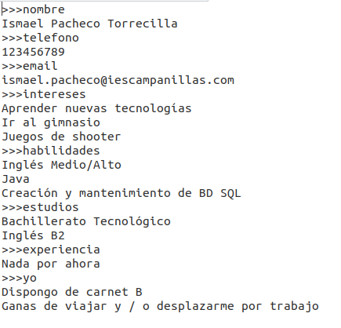

# Curriculum Sencillo JAVA / HTML
Este ejercicio es un simple programa en Java que escribe un archivo .html con un estilo sencillo (se puede mejorar) a partir de un archivo .txt con el que rellenar los datos de la web.

El archivo plantilla .txt del que se recogen los datos tiene la siguiente forma:

El programa escrito en java irá recogiendo los datos del .txt y los irá rellenando en el .html dando lugar al siguiente resultado:

Como se puede ver es un estilo bastante simple, sin embargo se podría modificar y conseguir un resultado bastante más vistoso convirtiendo a este simple programita en java en una herramienta bastante útil.

> :star: Si te ha gustado este generador de curriculum (aunque sea bastante simple), dale una estrellita al [repositorio](https://github.com/ismaelpacheco13/curriculumSencilloJavaHTML).

